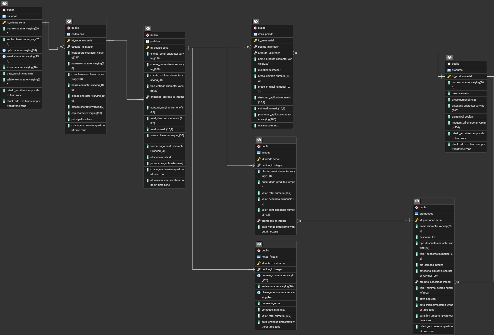

---

# Projeto Pizzaria — Sistema de Gestão (TypeScript + PostgreSQL)

Trabalho da disciplina P2 – UniAnchieta.
Sistema de gerenciamento de pizzaria utilizando Node.js, TypeScript e PostgreSQL.

---

## Integrantes

* Gabriel Araujo Santos — 2508678
* Leonardo da Graça Moraes — 2512238
* Paulo André Silva de Lima — 2512630
* Paulo Vitor Macieira Carvalho — 2508725

---

## Funcionalidades Implementadas

### Painel de Cliente
- Autenticação de usuários (login e cadastro)
- Coleta de todos os dados do cliente durante cadastro (CPF, telefone, data de nascimento, endereço completo)
- Visualização de catálogo de produtos filtrado por categoria
- Carrinho de compras com cálculo automático de total
- Finalização de pedido com modal para dados de entrega e forma de pagamento
- Histórico de pedidos pessoais
- Perfil do usuário com possibilidade de atualizar informações de contato e endereço
- Interface responsiva e intuitiva

### Painel de Administrador
- Autenticação de administrador
- Dashboard com estatísticas em tempo real (total de pedidos, receita, pedidos entregues/pendentes)
- Gerenciamento de produtos (adicionar, editar, remover)
- Gerenciamento de pedidos (visualizar status, atualizar estado)
- Sistema de promoções com desconto por dia da semana
- Geração de relatórios de vendas com produtos mais vendidos
- Impressão de relatórios formatados
- Download de relatórios em formato HTML
- Histórico completo de transações

### Backend
- API RESTful com endpoints para autenticação, produtos, pedidos, usuários e promoções
- Validação de dados em entrada (CPF, telefone, email, data de nascimento)
- Autenticação com bcrypt para senhas
- Transações no banco de dados para garantir consistência
- Tratamento de erros com mensagens claras ao usuário
- Endpoints para gerar relatórios com cálculos de vendas

---

## Estrutura do Projeto

```
Projeto-pizzaria/
│
├── 📂 web/                              # Camada de Apresentação (Frontend)
│   ├── app-admin.js                     # Lógica da interface do administrador
│   ├── app-cliente.js                   # Lógica da interface do cliente
│   ├── index-admin.html                 # Página principal do admin
│   ├── index-cliente.html               # Página principal do cliente
│   └── styles.css                       # Estilos visuais do sistema
│
├── 📂 src/                              # Código-fonte principal (Backend)
│   │
│   ├── app.ts                           # Configuração principal da aplicação
│   ├── main.ts                          # Ponto de entrada da aplicação
│   ├── server.ts                        # Inicialização do servidor HTTP
│   ├── interface.ts                     # Interfaces e tipos TypeScript
│   │
│   ├── 📂 config/                       # Configurações do sistema
│   │   └── database.ts                  # Configuração da conexão PostgreSQL
│   │
│   ├── 📂 database/                     # Camada de Persistência
│   │   ├── Database.ts                  # Classe de gerenciamento do banco
│   │   └── schema.sql                   # Estrutura SQL completa do banco
│   │
│   ├── 📂 models/                       # Modelos de Dados (Entidades)
│   │   └── index.ts                     # Exportação dos modelos
│   │
│   ├── 📂 repositories/                 # Camada de Acesso a Dados
│   │   ├── index.ts                     # Exportação dos repositórios
│   │   ├── PedidoRepository.ts          # Operações CRUD de Pedidos
│   │   ├── ProdutoRepository.ts         # Operações CRUD de Produtos
│   │   ├── PromocaoRepository.ts        # Operações CRUD de Promoções
│   │   └── UsuarioRepository.ts         # Operações CRUD de Usuários
│   │
│   ├── 📂 services/                     # Camada de Negócio
│   │   └── services.ts                  # Regras de negócio e lógica
│   │
│   └── 📂 types/                        # Tipos TypeScript Globais
│       └── index.ts                     # Definições de tipos
│
├── 📂 dist/                             # Código compilado (TypeScript → JavaScript)
│   └── [arquivos .js compilados]
│
├── 📂 Docs/                             # Documentação do Projeto
│   ├── DER.png                          # Diagrama Entidade-Relacionamento
│   ├── video-demonstracao.mp4           # Vídeo de demonstração
│   └── documentacao-tecnica.pdf         # Especificação técnica
│
├── 📂 uploads/                          # Arquivos de mídia enviados
│   └── [imagens de produtos]
│
├── 📂 node_modules/                     # Dependências instaladas pelo npm
│   └── [bibliotecas externas]
│
├── 📄 .gitignore                        # Arquivos ignorados pelo Git
├── 📄 .env                              # Variáveis de ambiente (não versionado)
├── 📄 package.json                      # Metadados e dependências do projeto
├── 📄 package-lock.json                 # Versões exatas das dependências
├── 📄 tsconfig.json                     # Configuração do compilador TypeScript
└── 📄 README.md                         # Instruções gerais do projeto
```

---

## Downloads Necessários

Node.js (LTS):
[https://nodejs.org/](https://nodejs.org/)

Docker Desktop:
[https://www.docker.com/products/docker-desktop/](https://www.docker.com/products/docker-desktop/)

PostgreSQL (versão usada: 18 / mínima recomendada: 15):
[https://www.postgresql.org/download/](https://www.postgresql.org/download/)

Git:
[https://git-scm.com/downloads](https://git-scm.com/downloads)

---

## Instalação do PostgreSQL

[https://www.postgresql.org/download/](https://www.postgresql.org/download/)

Versão usada: PostgreSQL 18
Versão mínima compatível: PostgreSQL 15

---

## Instalação via Docker

```bash
docker run -d \
  --name pizzaria-postgres \
  -e POSTGRES_USER=postgres \
  -e POSTGRES_PASSWORD=2079 \
  -e POSTGRES_DB=Pizzaria \
  -p 5432:5432 \
  postgres:18
```

---

## Instalação das Dependências

```bash
git clone <link-do-repo>
cd Projeto-pizzaria
npm install
```

Criar o arquivo `.env` (ou usar configuração local no server.ts):

```
DB_USER=postgres
DB_PASSWORD=2079
DB_HOST=localhost
DB_PORT=5432
DB_NAME=Pizzaria
```

Rodar o sistema:

```bash
npm run build
npm start
```

O servidor iniciará na porta 3000. Acesse:
- Cliente: http://localhost:3000/web/index-cliente.html
- Administrador: http://localhost:3000/web/index-admin.html

Build apenas (compilar TypeScript):

```bash
npm run build
```

---

## Credenciais Padrão

Administrador:
- Email: admin@pizzaria.com
- Senha: admin123

---

# Banco de Dados Completo (copiar e colar)

Apenas colar no pgAdmin, psql ou Docker.
GitHub exibirá botão automático de copiar.

---

```sql
CREATE EXTENSION IF NOT EXISTS "uuid-ossp";
CREATE EXTENSION IF NOT EXISTS "pgcrypto";

CREATE TABLE usuarios (
    id_cliente SERIAL PRIMARY KEY,
    nome VARCHAR(200) NOT NULL,
    senha VARCHAR(255) NOT NULL,
    cpf VARCHAR(14) UNIQUE NOT NULL,
    email VARCHAR(150) UNIQUE NOT NULL,
    tipo VARCHAR(10) NOT NULL CHECK (tipo IN ('cliente', 'admin')),
    data_nascimento DATE,
    telefone VARCHAR(20),
    criado_em TIMESTAMP DEFAULT CURRENT_TIMESTAMP,
    atualizado_em TIMESTAMP DEFAULT CURRENT_TIMESTAMP
);

CREATE INDEX idx_usuarios_email ON usuarios(email);
CREATE INDEX idx_usuarios_cpf ON usuarios(cpf);
CREATE INDEX idx_usuarios_tipo ON usuarios(tipo);

CREATE TABLE produtos (
    id_produto SERIAL PRIMARY KEY,
    nome VARCHAR(200) NOT NULL,
    descricao TEXT,
    preco DECIMAL(10, 2) NOT NULL CHECK (preco > 0),
    categoria VARCHAR(100) NOT NULL,
    disponivel BOOLEAN DEFAULT true,
    imagem_url VARCHAR(500),
    criado_em TIMESTAMP DEFAULT CURRENT_TIMESTAMP,
    atualizado_em TIMESTAMP DEFAULT CURRENT_TIMESTAMP
);

CREATE INDEX idx_produtos_categoria ON produtos(categoria);
CREATE INDEX idx_produtos_disponivel ON produtos(disponivel);

CREATE TABLE enderecos (
    id_endereco SERIAL PRIMARY KEY,
    usuario_id INTEGER REFERENCES usuarios(id_cliente) ON DELETE CASCADE,
    logradouro VARCHAR(255) NOT NULL,
    numero VARCHAR(20),
    complemento VARCHAR(100),
    bairro VARCHAR(100) NOT NULL,
    cidade VARCHAR(100) NOT NULL,
    estado VARCHAR(2) NOT NULL,
    cep VARCHAR(10) NOT NULL,
    principal BOOLEAN DEFAULT false,
    criado_em TIMESTAMP DEFAULT CURRENT_TIMESTAMP
);

CREATE INDEX idx_enderecos_usuario ON enderecos(usuario_id);

CREATE TABLE pedidos (
    id_pedido SERIAL PRIMARY KEY,
    cliente_email VARCHAR(150) NOT NULL,
    cliente_nome VARCHAR(200) NOT NULL,
    cliente_telefone VARCHAR(20),
    tipo_entrega VARCHAR(20) DEFAULT 'entrega' CHECK (tipo_entrega IN ('entrega', 'retirada')),
    endereco_entrega_id INTEGER REFERENCES enderecos(id_endereco),
    subtotal_original DECIMAL(10, 2) NOT NULL DEFAULT 0,
    total_descontos DECIMAL(10, 2) DEFAULT 0,
    total DECIMAL(10, 2) NOT NULL DEFAULT 0,
    status VARCHAR(30) DEFAULT 'pendente' 
        CHECK (status IN ('pendente', 'confirmado', 'preparando', 'pronto', 'entregue', 'cancelado')),
    forma_pagamento VARCHAR(50),
    observacoes TEXT,
    promocoes_aplicadas TEXT[],
    criado_em TIMESTAMP DEFAULT CURRENT_TIMESTAMP,
    atualizado_em TIMESTAMP DEFAULT CURRENT_TIMESTAMP
);

CREATE INDEX idx_pedidos_email ON pedidos(cliente_email);
CREATE INDEX idx_pedidos_status ON pedidos(status);
CREATE INDEX idx_pedidos_data ON pedidos(criado_em);

CREATE TABLE itens_pedido (
    id_item SERIAL PRIMARY KEY,
    pedido_id INTEGER NOT NULL REFERENCES pedidos(id_pedido) ON DELETE CASCADE,
    produto_id INTEGER NOT NULL REFERENCES produtos(id_produto),
    nome_produto VARCHAR(200) NOT NULL,
    quantidade INTEGER NOT NULL CHECK (quantidade > 0),
    preco_unitario DECIMAL(10, 2) NOT NULL,
    preco_original DECIMAL(10, 2),
    desconto_aplicado DECIMAL(10, 2) DEFAULT 0,
    subtotal DECIMAL(10, 2) NOT NULL,
    promocao_aplicada VARCHAR(200),
    observacoes TEXT
);

CREATE INDEX idx_itens_pedido ON itens_pedido(pedido_id);
CREATE INDEX idx_itens_produto ON itens_pedido(produto_id);

CREATE TABLE promocoes (
    id_promocao SERIAL PRIMARY KEY,
    nome VARCHAR(200) NOT NULL,
    descricao TEXT,
    tipo_desconto VARCHAR(20) NOT NULL CHECK (tipo_desconto IN ('percentual', 'valor_fixo')),
    valor_desconto DECIMAL(10, 2) NOT NULL CHECK (valor_desconto > 0),
    dia_semana INTEGER CHECK (dia_semana >= 0 AND dia_semana <= 6),
    categoria_aplicavel VARCHAR(100) NOT NULL,
    produto_especifico INTEGER REFERENCES produtos(id_produto),
    valor_minimo_pedido DECIMAL(10, 2) DEFAULT 0,
    ativa BOOLEAN DEFAULT true,
    data_inicio TIMESTAMP DEFAULT CURRENT_TIMESTAMP,
    data_fim TIMESTAMP,
    criado_em TIMESTAMP DEFAULT CURRENT_TIMESTAMP
);

CREATE INDEX idx_promocoes_dia ON promocoes(dia_semana);
CREATE INDEX idx_promocoes_categoria ON promocoes(categoria_aplicavel);
CREATE INDEX idx_promocoes_ativa ON promocoes(ativa);

CREATE TABLE vendas (
    id_venda SERIAL PRIMARY KEY,
    pedido_id INTEGER NOT NULL REFERENCES pedidos(id_pedido),
    cliente_email VARCHAR(150),
    quantidade_produtos INTEGER NOT NULL,
    valor_total DECIMAL(10, 2) NOT NULL,
    valor_desconto DECIMAL(10, 2) DEFAULT 0,
    valor_sem_desconto DECIMAL(10, 2) NOT NULL,
    promocao_id INTEGER REFERENCES promocoes(id_promocao),
    data_venda TIMESTAMP DEFAULT CURRENT_TIMESTAMP
);

CREATE INDEX idx_vendas_pedido ON vendas(pedido_id);
CREATE INDEX idx_vendas_data ON vendas(data_venda);
CREATE INDEX idx_vendas_promocao ON vendas(promocao_id);

CREATE TABLE notas_fiscais (
    id_nota_fiscal SERIAL PRIMARY KEY,
    pedido_id INTEGER NOT NULL REFERENCES pedidos(id_pedido),
    numero_nf VARCHAR(20) UNIQUE NOT NULL,
    serie VARCHAR(10),
    chave_acesso VARCHAR(44) UNIQUE,
    conteudo_txt TEXT NOT NULL,
    conteudo_html TEXT,
    valor_total DECIMAL(10, 2) NOT NULL,
    data_emissao TIMESTAMP DEFAULT CURRENT_TIMESTAMP
);

CREATE INDEX idx_notas_pedido ON notas_fiscais(pedido_id);
CREATE INDEX idx_notas_numero ON notas_fiscais(numero_nf);

CREATE OR REPLACE VIEW relatorio_vendas_dia AS
SELECT 
    DATE(v.data_venda) AS data,
    TO_CHAR(v.data_venda, 'DD/MM/YYYY') AS data_formatada,
    SUM(v.quantidade_produtos) AS total_produtos,
    SUM(v.valor_total) AS total_vendas,
    SUM(v.valor_desconto) AS total_descontos,
    SUM(v.valor_sem_desconto) AS total_sem_descontos,
    COUNT(DISTINCT v.pedido_id) AS total_pedidos
FROM vendas v
GROUP BY DATE(v.data_venda), TO_CHAR(v.data_venda, 'DD/MM/YYYY')
ORDER BY DATE(v.data_venda) DESC;

CREATE OR REPLACE VIEW relatorio_vendas_mes AS
SELECT 
    TO_CHAR(v.data_venda, 'MM/YYYY') AS mes,
    DATE_TRUNC('month', v.data_venda) AS mes_completo,
    SUM(v.quantidade_produtos) AS total_produtos,
    SUM(v.valor_total) AS total_vendas,
    SUM(v.valor_desconto) AS total_descontos,
    SUM(v.valor_sem_desconto) AS total_sem_descontos,
    COUNT(DISTINCT v.pedido_id) AS total_pedidos
FROM vendas v
GROUP BY TO_CHAR(v.data_venda, 'MM/YYYY'), DATE_TRUNC('month', v.data_venda)
ORDER BY DATE_TRUNC('month', v.data_venda) DESC;

CREATE OR REPLACE VIEW promocoes_mais_usadas AS
SELECT 
    p.id_promocao,
    p.nome,
    p.descricao,
    p.tipo_desconto,
    p.valor_desconto,
    COUNT(v.id_venda) AS vezes_usada,
    SUM(v.valor_desconto) AS total_desconto_concedido,
    SUM(v.valor_total) AS total_vendas_com_promocao
FROM promocoes p
LEFT JOIN vendas v ON p.id_promocao = v.promocao_id
GROUP BY p.id_promocao, p.nome, p.descricao, p.tipo_desconto, p.valor_desconto
ORDER BY vezes_usada DESC;

CREATE OR REPLACE VIEW produtos_mais_vendidos AS
SELECT 
    p.id_produto,
    p.nome,
    p.categoria,
    COUNT(ip.id_item) AS quantidade_vendas,
    SUM(ip.quantidade) AS total_unidades,
    SUM(ip.subtotal) AS faturamento_total
FROM produtos p
JOIN itens_pedido ip ON p.id_produto = ip.produto_id
JOIN pedidos ped ON ip.pedido_id = ped.id_pedido
WHERE ped.status NOT IN ('cancelado')
GROUP BY p.id_produto, p.nome, p.categoria
ORDER BY total_unidades DESC;

CREATE OR REPLACE FUNCTION atualizar_timestamp()
RETURNS TRIGGER AS $$
BEGIN
    NEW.atualizado_em = CURRENT_TIMESTAMP;
    RETURN NEW;
END;
$$ LANGUAGE plpgsql;

CREATE TRIGGER trigger_usuarios_update
    BEFORE UPDATE ON usuarios
    FOR EACH ROW
    EXECUTE FUNCTION atualizar_timestamp();

CREATE TRIGGER trigger_produtos_update
    BEFORE UPDATE ON produtos
    FOR EACH ROW
    EXECUTE FUNCTION atualizar_timestamp();

CREATE TRIGGER trigger_pedidos_update
    BEFORE UPDATE ON pedidos
    FOR EACH ROW
    EXECUTE FUNCTION atualizar_timestamp();

CREATE OR REPLACE FUNCTION calcular_totais_pedido()
RETURNS TRIGGER AS $$
DECLARE
    v_subtotal DECIMAL(10, 2);
BEGIN
    SELECT COALESCE(SUM(subtotal), 0) 
    INTO v_subtotal
    FROM itens_pedido 
    WHERE pedido_id = NEW.pedido_id;
    
    UPDATE pedidos 
    SET subtotal_original = v_subtotal,
        total = v_subtotal - COALESCE(total_descontos, 0)
    WHERE id_pedido = NEW.pedido_id;
    
    RETURN NEW;
END;
$$ LANGUAGE plpgsql;

CREATE TRIGGER trigger_calcular_totais
    AFTER INSERT OR UPDATE ON itens_pedido
    FOR EACH ROW
    EXECUTE FUNCTION calcular_totais_pedido();

CREATE OR REPLACE FUNCTION registrar_venda()
RETURNS TRIGGER AS $$
DECLARE
    v_qtd_produtos INTEGER;
BEGIN
    IF NEW.status = 'confirmado' AND (OLD.status IS NULL OR OLD.status != 'confirmado') THEN
        SELECT COALESCE(SUM(quantidade), 0)
        INTO v_qtd_produtos
        FROM itens_pedido
        WHERE pedido_id = NEW.id_pedido;
        
        INSERT INTO vendas (
            pedido_id, 
            cliente_email,
            quantidade_produtos,
            valor_total, 
            valor_desconto, 
            valor_sem_desconto
        ) VALUES (
            NEW.id_pedido,
            NEW.cliente_email,
            v_qtd_produtos,
            NEW.total,
            COALESCE(NEW.total_descontos, 0),
            NEW.subtotal_original
        );
    END IF;
    
    RETURN NEW;
END;
$$ LANGUAGE plpgsql;

CREATE TRIGGER trigger_registrar_venda
    AFTER INSERT OR UPDATE ON pedidos
    FOR EACH ROW
    EXECUTE FUNCTION registrar_venda();

INSERT INTO usuarios (nome, senha, cpf, email, tipo, data_nascimento) 
VALUES (
    'Administrador',
    crypt('admin123', gen_salt('bf')),
    '000.000.000-00',
    'admin@pizzaria.com',
    'admin',
    '1990-01-01'
);

INSERT INTO produtos (nome, descricao, preco, categoria, disponivel) VALUES
('Pizza Calabresa', 'Pizza grande de calabresa com cebola', 39.00, 'pizza', true),
('Pizza Margherita', 'Pizza grande margherita tradicional', 42.00, 'pizza', true),
('Pizza Portuguesa', 'Pizza grande portuguesa completa', 45.00, 'pizza', true),
('Pizza Quatro Queijos', 'Pizza grande com 4 queijos', 48.00, 'pizza', true),
('Refrigerante Coca-Cola 2L', 'Refrigerante 2 litros', 12.00, 'bebida', true),
('Refrigerante Guaraná 2L', 'Refrigerante 2 litros', 10.00, 'bebida', true),
('Suco Natural 500ml', 'Suco natural de laranja', 8.00, 'bebida', true),
('Sorvete', 'Sorvete de chocolate 500ml', 15.00, 'sobremesa', true),
('Pudim', 'Pudim de leite caseiro', 12.00, 'sobremesa', true);

INSERT INTO promocoes (nome, descricao, tipo_desconto, valor_desconto, dia_semana, categoria_aplicavel, valor_minimo_pedido, ativa) VALUES
('Segunda Especial - Pizza Grande', '30% de desconto em todas as pizzas grandes', 'percentual', 30, 1, 'pizza', 0, true),
('Terça das Bebidas', 'R$ 5,00 de desconto em bebidas', 'valor_fixo', 5, 2, 'bebida', 0, true),
('Quarta Doce', '25% off em sobremesas', 'percentual', 25, 3, 'sobremesa', 0, true),
('Quinta da Família', '20% em pedidos acima de R$ 50', 'percentual', 20, 4, 'todos', 50, true),
('Sexta Premium', '15% em todo o pedido', 'percentual', 15, 5, 'todos', 0, true),
('Sábado da Pizza', 'R$ 10,00 off em pizzas', 'valor_fixo', 10, 6, 'pizza', 0, true),
('Domingo em Família', '25% em pedidos acima de R$ 80', 'percentual', 25, 0, 'todos', 80, true);
```

---


Modelo Entidade-Relacionamento (MER)

Abaixo está o MER textual do banco de dados, representando entidades, atributos e relacionamentos usados no sistema.
# MER – Modelo Entidade-Relacionamento

## Entidade: Usuarios
- id_cliente (PK)
- nome
- senha
- cpf
- email
- tipo
- data_nascimento
- telefone
- criado_em
- atualizado_em

## Entidade: Produtos
- id_produto (PK)
- nome
- descricao
- preco
- categoria
- disponivel
- imagem_url
- criado_em
- atualizado_em

## Entidade: Enderecos
- id_endereco (PK)
- usuario_id (FK → Usuarios.id_cliente)
- logradouro
- numero
- complemento
- bairro
- cidade
- estado
- cep
- principal
- criado_em

## Entidade: Pedidos
- id_pedido (PK)
- cliente_email
- cliente_nome
- cliente_telefone
- tipo_entrega
- endereco_entrega_id (FK → Enderecos.id_endereco)
- subtotal_original
- total_descontos
- total
- status
- forma_pagamento
- observacoes
- promocoes_aplicadas
- criado_em
- atualizado_em

## Entidade: Itens_Pedido
- id_item (PK)
- pedido_id (FK → Pedidos.id_pedido)
- produto_id (FK → Produtos.id_produto)
- nome_produto
- quantidade
- preco_unitario
- preco_original
- desconto_aplicado
- subtotal
- promocao_aplicada
- observacoes

## Entidade: Promocoes
- id_promocao (PK)
- nome
- descricao
- tipo_desconto
- valor_desconto
- dia_semana
- categoria_aplicavel
- produto_especifico (FK → Produtos.id_produto)
- valor_minimo_pedido
- ativa
- data_inicio
- data_fim
- criado_em

## Entidade: Vendas
- id_venda (PK)
- pedido_id (FK → Pedidos.id_pedido)
- cliente_email
- quantidade_produtos
- valor_total
- valor_desconto
- valor_sem_desconto
- promocao_id (FK → Promocoes.id_promocao)
- data_venda

## Entidade: Notas_Fiscais
- id_nota_fiscal (PK)
- pedido_id (FK → Pedidos.id_pedido)
- numero_nf
- serie
- chave_acesso
- conteudo_txt
- conteudo_html
- valor_total
- data_emissao

# Relacionamentos Principais

Usuarios (1) —— (N) Enderecos  
Usuarios (1) —— (N) Pedidos  
Pedidos (1) —— (N) Itens_Pedido  
Produtos (1) —— (N) Itens_Pedido  
Promocoes (1) —— (N) Vendas  
Pedidos (1) —— (1) Notas_Fiscais


# Diagrama DER (Diagrama do Banco)


